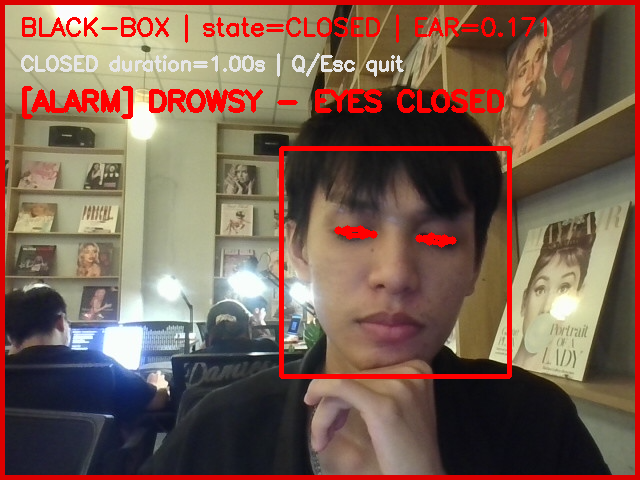
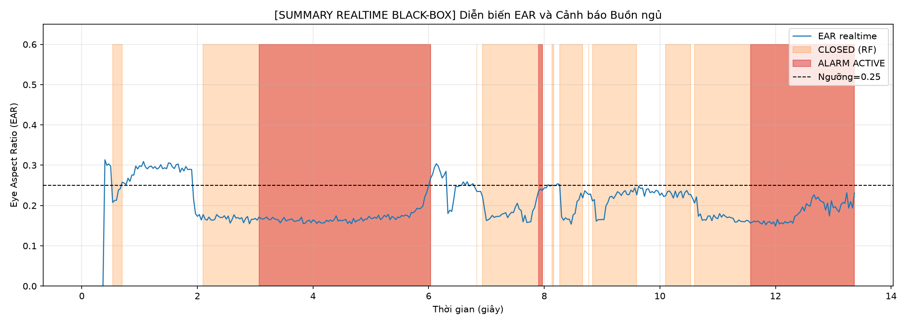
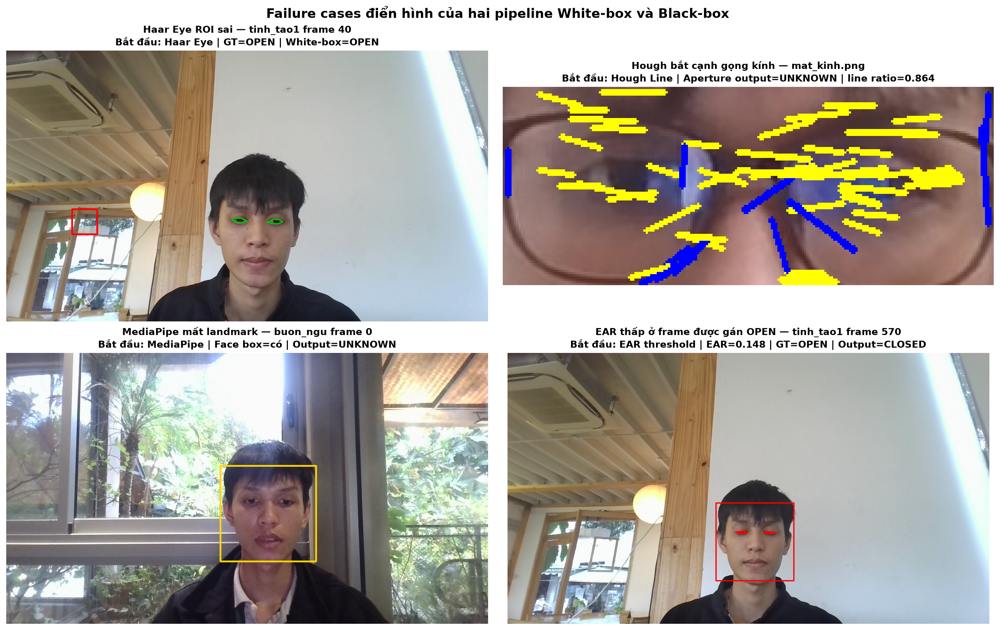
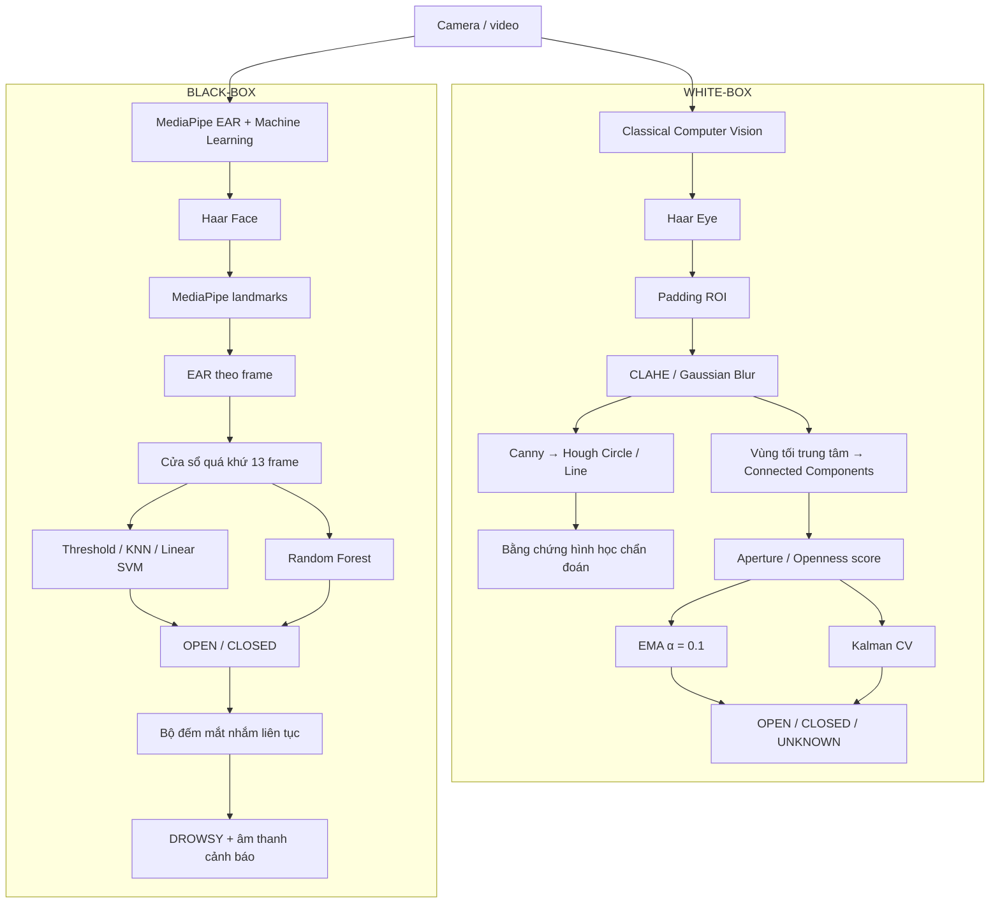

# Hệ thống phát hiện buồn ngủ qua camera

Đồ án Thị giác máy tính xây dựng hệ thống giám sát trạng thái mắt và cảnh báo buồn ngủ từ webcam thông thường. Project triển khai **hai pipeline độc lập, cùng cấp** để khảo sát hai hướng tiếp cận cho cùng một bài toán:

- **White-box – Classical Computer Vision:** giải thích được từng bước từ ROI mắt, tiền xử lý, bằng chứng hình học đến tín hiệu độ mở mắt; so sánh bộ lọc EMA và Kalman CV.
- **Black-box – Machine Learning:** trích Eye Aspect Ratio (EAR) bằng MediaPipe, tạo đặc trưng trên cửa sổ 13 frame và so sánh Threshold, KNN, Linear SVM với Random Forest.

Project ưu tiên ba tiêu chí: chạy được theo thời gian thực, đánh giá trên cùng ground truth và giải thích được vì sao hệ thống đưa ra cảnh báo.

## Demo

### Cảnh báo realtime Black-box



Sau khi cửa sổ realtime đóng, chương trình lưu biểu đồ tóm tắt EAR, xác suất/trạng thái dự đoán và các khoảng cảnh báo:



### Phân tích trường hợp thất bại



Montage chỉ ra lỗi bắt đầu ở bước nào, ví dụ ROI Haar sai, Hough bắt cạnh gọng kính, MediaPipe mất landmark hoặc EAR thấp dù người dùng vẫn tỉnh.

## Kiến trúc hệ thống



> Trong White-box, Hough và aperture là hai nhánh song song sau bước tiền xử lý. Hough tạo bằng chứng hình học để chẩn đoán; openness score được tính từ nhánh aperture, không lấy trực tiếp từ số vòng tròn hoặc đường Hough.

## Kết quả chính

### White-box: EMA và Kalman CV

Kết quả trên pilot `buon_ngu1.mp4` với 851 frame đã gán nhãn thủ công:

| Phương pháp | Accuracy | Precision CLOSED | Recall CLOSED | F1 CLOSED | Lag trung bình | Flicker |
|---|---:|---:|---:|---:|---:|---:|
| EMA, α = 0.1 | **0.804** | 0.815 | **0.929** | **0.868** | 2.06 frame | **36** |
| Kalman CV | 0.800 | **0.834** | 0.890 | 0.861 | **1.25 frame** | 96 |

Kết quả thể hiện một trade-off rõ ràng: **Kalman phản hồi chuyển trạng thái nhanh hơn**, trong khi **EMA ổn định hơn và đạt F1 CLOSED cao hơn** ở cấu hình pilot. Mô phỏng tín hiệu có ground truth cũng cho thấy Kalman trễ 1 frame ở hai chiều chuyển trạng thái, so với EMA trễ 8 frame khi đóng và 7 frame khi mở.

### Black-box: baseline và Random Forest

Các mô hình được đánh giá trên cùng validation session, sử dụng nhãn CLOSED làm lớp dương:

| Mô hình | Accuracy | Precision CLOSED | Recall CLOSED | F1 CLOSED | False-positive rate |
|---|---:|---:|---:|---:|---:|
| EAR threshold 0.25 | 0.866 | 0.741 | **0.997** | **0.850** | 0.216 |
| KNN trên EAR hiện tại | 0.856 | 0.732 | 0.984 | 0.839 | 0.224 |
| Linear SVM, cửa sổ 13 EAR | 0.840 | 0.711 | 0.982 | 0.825 | 0.248 |
| Random Forest temporal | 0.862 | **0.747** | 0.966 | 0.843 | 0.203 |
| Random Forest validation-tuned | **0.868** | **0.756** | 0.966 | 0.848 | **0.194** |

Random Forest tối ưu trên validation dùng `100` cây, `max_depth=8`, `min_samples_leaf=3`. Mô hình cải thiện KNN và SVM về F1 CLOSED, đồng thời có false-positive rate thấp nhất trong bảng. Baseline threshold vẫn nhỉnh hơn 0.002 F1 do ưu tiên recall gần tuyệt đối; vì vậy lựa chọn cuối phụ thuộc vào việc hệ thống ưu tiên **không bỏ sót mắt nhắm** hay **giảm cảnh báo sai**.

## Điểm kỹ thuật nổi bật

### White-box

1. Haar Cascade định vị ROI mắt; padding được khảo sát để tránh cắt mất mí mắt.
2. CLAHE/Gaussian Blur và Canny tạo ảnh trung gian có thể quan sát trực tiếp.
3. Hough Circle/Line cung cấp bằng chứng hình học và hỗ trợ phân tích failure case.
4. Nhánh aperture tìm vùng tối trung tâm và chuẩn hóa độ mở mắt theo calibration cá nhân.
5. EMA và Kalman CV nhận **cùng một chuỗi measurement**, sau đó được so sánh bằng F1, flicker và transition lag.

### Black-box

1. Haar Face giới hạn vùng tìm kiếm; MediaPipe cung cấp landmark hai mắt.
2. EAR được tính cho từng frame và gom thành cửa sổ chỉ sử dụng các frame quá khứ, phù hợp realtime.
3. Chín đặc trưng thời gian mô tả mức EAR hiện tại, trung bình, độ lệch chuẩn, độ dốc, tỷ lệ dưới ngưỡng, chuỗi EAR thấp dài nhất và chất lượng measurement.
4. Random Forest được giải thích bằng feature importance và số cây bỏ phiếu cho từng lớp.
5. Cảnh báo chỉ bật khi trạng thái CLOSED kéo dài đủ thời gian cấu hình, giúp phân biệt chớp mắt ngắn với nhắm mắt kéo dài.

## Cấu trúc repository

```text
project/
├── notebooks/
│   ├── 01_whitebox_research.ipynb
│   └── 02_blackbox_research.ipynb
├── data/
│   ├── raw/
│   │   ├── images/                 # Ảnh khảo sát bốn điều kiện
│   │   └── videos/                 # Video tỉnh táo và buồn ngủ
│   ├── labels/                     # Ground truth OPEN/CLOSED/UNKNOWN
│   └── processed/                  # Cache đặc trưng, biểu đồ và video overlay
├── models/cascades/                # Haar Face và Haar Eye
├── assets/audio/am_thanh.wav       # Âm thanh cảnh báo
├── requirements.txt
└── README.md
```

Hai notebook chứa toàn bộ pipeline nghiên cứu và không phụ thuộc vào file `.py` bên ngoài.

## Cài đặt

Project đã được chạy với Python 3.12 trên Windows.

```powershell
git clone https://github.com/Le-Van-Khoicw/ThiGiacMayTinh.git
cd ThiGiacMayTinh

py -m venv .venv
.\.venv\Scripts\Activate.ps1
py -m pip install --upgrade pip
pip install -r requirements.txt
```

Khởi động Jupyter từ thư mục gốc:

```powershell
jupyter notebook
```

Sau đó mở và chạy theo thứ tự:

1. `notebooks/01_whitebox_research.ipynb`
2. `notebooks/02_blackbox_research.ipynb`

Các cell tương tác như gán nhãn và realtime nên được chạy riêng, không dùng `Run All`, vì chúng mở cửa sổ OpenCV bên ngoài notebook.

## Chạy demo realtime

Trong notebook tương ứng, đặt nguồn video thành webcam:

```python
REALTIME_SOURCE = 0
```

Hoặc dùng video có sẵn:

```python
REALTIME_SOURCE = str(VIDEOS_DIR / "buon_ngu1.mp4")
```

Chạy cell demo và nhấn `Q` hoặc `Esc` để kết thúc. Black-box hiển thị:

- khung Haar Face;
- 12 điểm/đường viền landmark mắt;
- EAR và trạng thái OPEN/CLOSED;
- thời gian CLOSED liên tục;
- viền đỏ, thông báo DROWSY và `assets/audio/am_thanh.wav` khi cảnh báo bật;
- biểu đồ summary được lưu sau phiên chạy.

## Ground truth và cách chia dữ liệu

Nhãn frame dùng định dạng:

```csv
frame,label
0,OPEN
1,OPEN
2,CLOSED
3,UNKNOWN
```

Trong cửa sổ gán nhãn:

| Phím | Chức năng |
|---|---|
| `O` | OPEN – mắt mở |
| `C` | CLOSED – mắt nhắm |
| `U` | UNKNOWN – không đủ cơ sở quan sát |
| `Space` | Lặp nhãn frame trước |
| `B` | Quay lại frame trước để sửa |
| `Q` / `Esc` | Lưu và thoát |

Dữ liệu được chia theo **video/session**, không trộn ngẫu nhiên các frame liền nhau giữa train và validation. Cách chia này ngăn các frame gần như giống nhau xuất hiện ở cả hai phía và làm metric tăng giả tạo.

## Phạm vi kết quả

Các bảng hiện tại mô tả thí nghiệm trên dữ liệu cá nhân đã gán nhãn của project. Chúng chứng minh pipeline hoạt động, cho phép so sánh công bằng giữa các phương pháp và chỉ ra trade-off của từng lựa chọn. Khi mở rộng thành sản phẩm cho nhiều tài xế, cần bổ sung test session độc lập và dữ liệu từ nhiều người, điều kiện chiếu sáng, tư thế đầu và loại kính khác nhau.

## Tài liệu nền tảng

1. G. He, S. Oueida, T. Ward, [“Gazing into the Abyss: Real-time Gaze Estimation”](https://arxiv.org/pdf/1711.06918), 2017.
2. J. D. Ortega et al., [“User-adaptive Eyelid Aperture Estimation for Blink Detection in Driver Monitoring Systems”](https://www.scitepress.org/Papers/2020/93690/93690.pdf), VEHITS 2020.
3. T. Soukupová, J. Čech, [“Real-Time Eye Blink Detection using Facial Landmarks”](http://cmp.felk.cvut.cz/pub/cmp/articles/cech/Soukupova-CVWW-2016.pdf), 2016.
4. C. Lugaresi et al., [“MediaPipe: A Framework for Building Perception Pipelines”](https://arxiv.org/pdf/1906.08172), 2019.
5. L. Breiman, [“Random Forests”](https://mfm.uchicago.edu/wp-content/uploads/2020/06/Breiman-Random-Forests.pdf), 2001.
6. R. E. Kalman, [“A New Approach to Linear Filtering and Prediction Problems”](https://www.cs.unc.edu/~welch/kalman/media/pdf/Kalman1960.pdf), 1960.

## Công nghệ sử dụng

`Python` · `OpenCV` · `MediaPipe` · `NumPy` · `SciPy` · `scikit-learn` · `Matplotlib` · `Jupyter Notebook`
